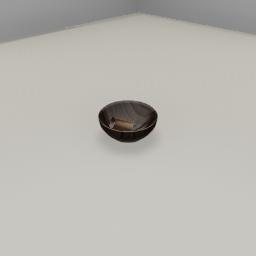

##### Semantic States

# Proximity to region (`Overlap` output data)

## `Overlap` output data

An **overlap** is similar to a [raycast](raycast.md) but it doesn't shoot a ray; it just returns which objects, if any, are within a 3D shape. Overlaps can be very useful in procedural object placement.

In TDW, you can request [`Overlap`](../../api/output_data.md#Overlap) output data by sending one of the following commands:

- [`send_overlap_box`](../../api/command_api.md#send_overlap_box) 
- [`send_overlap_sphere`](../../api/command_api.md#send_overlap_sphere) 
- [`send_overlap_capsule`](../../api/command_api.md#send_overlap_capsule) 

Like `Raycast` output data, `Overlap` output data has an ID and is always sent exactly once (never per-frame).

## Determine if an object is in a bowl

Suppose that [like in the previous example](raycast.md) we want to place an object in a bowl. This time, we'll position the object at a random point above the bowl and let it fall. We'll use [cached bounds data](../../python/librarian/model_librarian.md) to get the position and [`Rigidbody` output data](../../api/output_data.md#Rigidbody) to determine when the object stops moving.

```python
import numpy as np
from tdw.controller import Controller
from tdw.tdw_utils import TDWUtils
from tdw.output_data import OutputData, Rigidbodies
from tdw.librarian import ModelLibrarian

# Create a random number generator with seed 0.
rng = np.random.RandomState(0)

model_librarian = ModelLibrarian()
bowl_record = model_librarian.get_record("round_bowl_small_walnut")
c = Controller()
bowl_id = c.get_unique_id()
jug_id = c.get_unique_id()

# Set the position of the bowl.
bowl_position = {"x": -1, "y": 0, "z": 0.5}

# Pick a position slightly above the bowl.
bowl_left_right = np.linalg.norm(TDWUtils.vector3_to_array(bowl_record.bounds["left"]) -
                                 TDWUtils.vector3_to_array(bowl_record.bounds["right"]))
bowl_front_back = np.linalg.norm(TDWUtils.vector3_to_array(bowl_record.bounds["front"]) -
                                 TDWUtils.vector3_to_array(bowl_record.bounds["back"]))
object_x = float(rng.uniform(bowl_position["x"] - (bowl_left_right / 2), bowl_position["x"] + (bowl_left_right / 2)))
object_y = float(rng.uniform(2.5, 4))
object_z = float(rng.uniform(bowl_position["z"] - (bowl_front_back / 2), bowl_position["z"] + (bowl_front_back / 2)))
resp = c.communicate([TDWUtils.create_empty_room(12, 12),
                      c.get_add_object(position=bowl_position,
                                       object_id=bowl_id,
                                       model_name=bowl_record.name),
                      c.get_add_object(position={"x": object_x, "y": object_y, "z": object_z},
                                       object_id=jug_id,
                                       model_name="jug03"),
                      {"$type": "send_rigidbodies",
                       "frequency": "always",
                       "ids": [jug_id]}])
sleeping = False
while not sleeping:
    for i in range(len(resp) - 1):
        # Get rigidbody output data.
        r_id = OutputData.get_data_type_id(resp[i])
        if r_id == "rigi":
            rigidbodies = Rigidbodies(resp[i])
            # We know that there is only one object in the rigidbody data (the jug).
            if rigidbodies.get_sleeping(0):
                sleeping = True
                break
    resp = c.communicate([])
c.communicate({"$type": "terminate"})
```

Now we need to determine if the object is in the bowl. This is harder than it might seem!

- We can visually check if the object is in the bowl. But this won't work if we need to *programmatically* know if the object is in the bowl.
- We can't use bounds data because bounds data is box-shaped and the bowl is round.

We'll define an overlap shape that is slightly smaller than the bowl. If the object is within this shape, then it must be in the bowl:

```python
import numpy as np
from tdw.controller import Controller
from tdw.tdw_utils import TDWUtils
from tdw.add_ons.third_person_camera import ThirdPersonCamera
from tdw.add_ons.image_capture import ImageCapture
from tdw.backend.paths import EXAMPLE_CONTROLLER_OUTPUT_PATH
from tdw.output_data import OutputData, Rigidbodies, Overlap
from tdw.librarian import ModelLibrarian

# Create a random number generator with seed 0.
rng = np.random.RandomState(0)

model_librarian = ModelLibrarian()
bowl_record = model_librarian.get_record("round_bowl_small_walnut")
c = Controller()
bowl_id = c.get_unique_id()
jug_id = c.get_unique_id()
camera = ThirdPersonCamera(position={"x": 0.5, "y": 1.6, "z": -1},
                           look_at=bowl_id,
                           avatar_id="a")
path = EXAMPLE_CONTROLLER_OUTPUT_PATH.joinpath("overlap")
print(f"Images will be saved to: {path}")
capture = ImageCapture(avatar_ids=[camera.avatar_id], path=path)
c.add_ons.extend([camera, capture])

# Set the position of the bowl.
bowl_position = {"x": -1, "y": 0, "z": 0.5}

# Pick a position slightly above the bowl.
bowl_left_right = np.linalg.norm(TDWUtils.vector3_to_array(bowl_record.bounds["left"]) -
                                 TDWUtils.vector3_to_array(bowl_record.bounds["right"]))
bowl_front_back = np.linalg.norm(TDWUtils.vector3_to_array(bowl_record.bounds["front"]) -
                                 TDWUtils.vector3_to_array(bowl_record.bounds["back"]))
object_x = float(rng.uniform(bowl_position["x"] - (bowl_left_right / 2), bowl_position["x"] + (bowl_left_right / 2)))
object_y = float(rng.uniform(2.5, 4))
object_z = float(rng.uniform(bowl_position["z"] - (bowl_front_back / 2), bowl_position["z"] + (bowl_front_back / 2)))

resp = c.communicate([TDWUtils.create_empty_room(12, 12),
                      c.get_add_object(position=bowl_position,
                                       object_id=bowl_id,
                                       model_name=bowl_record.name),
                      c.get_add_object(position={"x": object_x, "y": object_y, "z": object_z},
                                       object_id=jug_id,
                                       model_name="jug03"),
                      {"$type": "send_rigidbodies",
                       "frequency": "always",
                       "ids": [jug_id]}])
sleeping = False
while not sleeping:
    for i in range(len(resp) - 1):
        # Get rigidbody output data.
        r_id = OutputData.get_data_type_id(resp[i])
        if r_id == "rigi":
            rigidbodies = Rigidbodies(resp[i])
            # We know that there is only one object in the rigidbody data (the jug).
            if rigidbodies.get_sleeping(0):
                sleeping = True
                break
    resp = c.communicate([])

# Define an overlap to determine if the object is in the bowl.
overlap_id = c.get_unique_id()
if bowl_left_right < bowl_front_back:
    bowl_smaller_extent = bowl_left_right / 2
else:
    bowl_smaller_extent = bowl_front_back / 2
# Shrink the extents a little more.
bowl_smaller_extent *= 0.9
resp = c.communicate({"$type": "send_overlap_sphere",
                      "radius": bowl_smaller_extent,
                      "position": {"x": bowl_position["x"],
                                   "y": 0,
                                   "z": bowl_position["z"]},
                      "id": overlap_id})
for i in range(len(resp) - 1):
    r_id = OutputData.get_data_type_id(resp[i])
    # Get the overlap.
    if r_id == "over":
        overlap = Overlap(resp[i])
        # Is this the correct overlap?
        if overlap.get_id() == overlap_id:
            object_ids = overlap.get_object_ids()
            # Does the overlap contain the jug?
            if jug_id in object_ids:
                print("The jug is in the bowl!")
c.communicate({"$type": "terminate"})
```

Result:

```
The jug is in the bowl!
```



***

**Next: [Proximity to other objects (the `TriggerCollisionManager` add-on)](trigger_collisions.md)**

[Return to the README](../../../README.md)

***

Example controllers:

- [overlap.py](https://github.com/threedworld-mit/tdw/blob/master/Python/example_controllers/semantic_states/overlap.py) Use overlap data to determine if an object is in a bowl.

Python API:

- [`ModelRecord.bounds`](../../python/librarian/model_librarian.md)

Command API:

- [`send_overlap_box`](../../api/command_api.md#send_overlap_box) 
- [`send_overlap_sphere`](../../api/command_api.md#send_overlap_sphere) 
- [`send_overlap_capsule`](../../api/command_api.md#send_overlap_capsule) 
- [`send_rigidbodies`](../../api/command_api.md#send_rigidbodies) 

Output Data:

- [`Overlap`](../../api/output_data.md#Overlap)
- [`Rigidbodies`](../../api/output_data.md#Rigidbodies)
